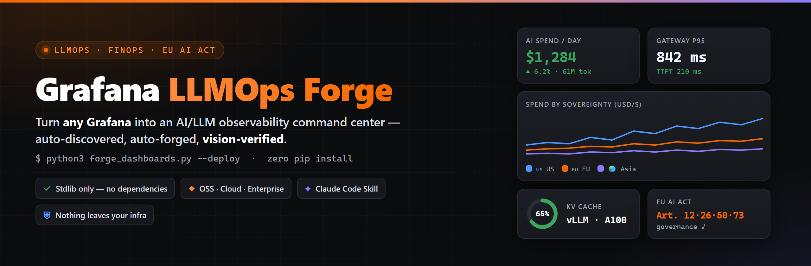
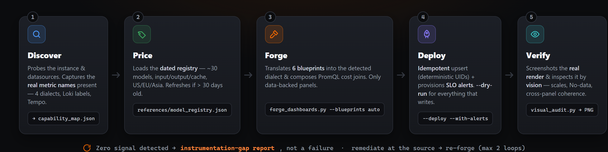
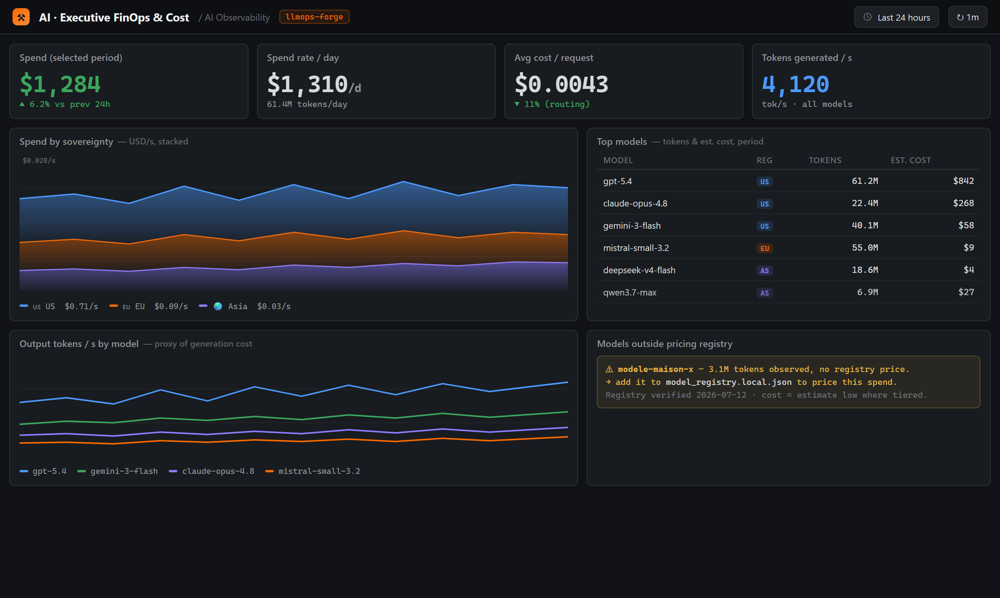
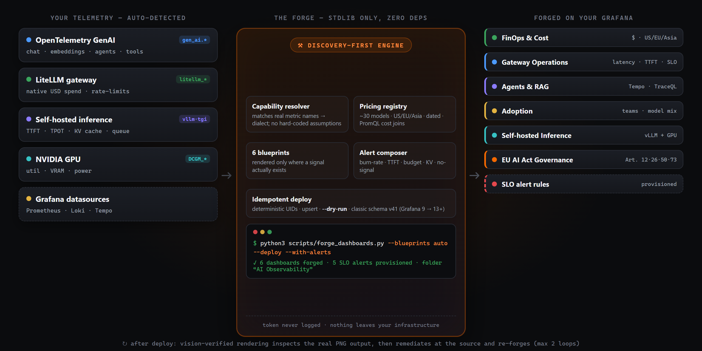
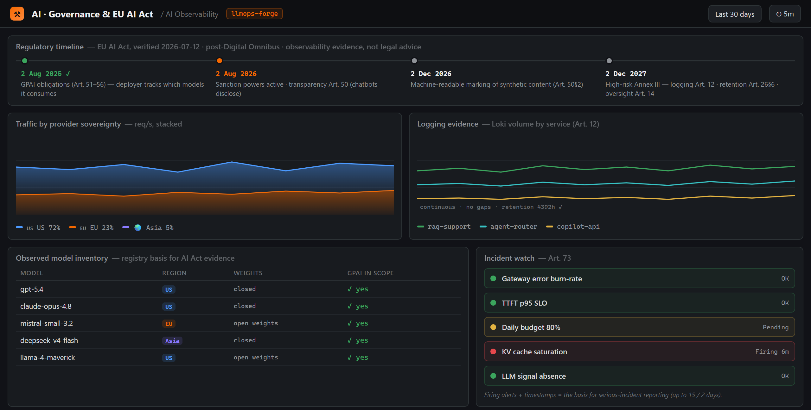

<div align="center">

<a href="README.md">English</a> · <a href="README.fr.md">Français</a>



# Grafana LLMOps Forge

### Transformez **n'importe quel Grafana** en centre de commandement de l'observabilité IA/LLM — LLMOps, FinOps &amp; gouvernance EU AI Act, auto-découverts et auto-forgés.

[](LICENSE)
[](#prérequis)
[-8B7BFF)](#prérequis)
[](#compatibilité)
[](#lutiliser-comme-skill-claude-code)
[](https://github.com/alebgl77/grafana-llmops-forge/actions/workflows/ci.yml)

**Prérequis unique : une URL Grafana + un token de compte de service. Tout le reste est découvert ou provisionné.**

`Aucune donnée ne quitte votre infrastructure` · `aucun pip install (stdlib)` · `idempotent & --dry-run` · `le token n'est jamais journalisé`

</div>

---

## Qu'est-ce que Grafana LLMOps Forge ?

**Grafana LLMOps Forge est une boîte à outils Python discovery-first, zéro dépendance (et une Skill Claude Code / Agent) qui transforme un Grafana que vous exploitez déjà en centre de commandement de l'observabilité IA/LLM.** Vous lui donnez une URL et un token ; il découvre la télémétrie LLM réellement présente, forge les tableaux de bord coûts, gateway, agents, adoption, inférence et gouvernance EU AI Act à partir de vos *vrais* noms de métriques, provisionne les alertes SLO, puis vérifie par la vision le rendu réel. C'est un **complément** à Langfuse, Phoenix, OpenLIT ou OpenTelemetry — pas un remplacement.

- 🔭 **Auto-découverte de 4 dialectes de télémétrie** — OpenTelemetry GenAI (`gen_ai.*`), spend LiteLLM, inférence auto-hébergée (vLLM / TGI / Ollama), et GPU NVIDIA DCGM — en capturant les noms de métriques qui existent vraiment, pour ne construire que des panels qui renvoient des données.
- 🧱 **Forge 6 blueprints de dashboards** — FinOps & coûts, gateway, traçage agents & RAG, adoption, inférence auto-hébergée, et gouvernance EU AI Act — plus les règles d'alerte SLO.
- 💶 **Le coût est calculé, pas espéré** — un registre embarqué et daté de ~30 modèles (input/output/cache, souveraineté US/EU/Asie) composé en PromQL dans votre propre Grafana.
- 👁️ **Vérifie le rendu par la vision** — capture les dashboards réels et les inspecte (échelles improbables, panels « No data », incohérences inter-panels) avant d'annoncer un succès.

<div align="center">

</div>

---

## Démarrage rapide

### Essayez en 60 secondes — hors ligne, sans Grafana, sans inscription

```bash
git clone https://github.com/alebgl77/grafana-llmops-forge
cd grafana-llmops-forge

# Génère les six dashboards en JSON à partir d'une capability map simulée
python3 scripts/forge_dashboards.py --selftest
```

Vous obtenez les six JSON dans `./selftest_output/` — idéal pour inspecter les panels et le PromQL avant de toucher à quoi que ce soit de réel.

### Pointez-le vers un vrai Grafana

```bash
export GRAFANA_URL="https://grafana.exemple.com"      # sans slash final
export GRAFANA_TOKEN="glsa_..."                        # token de compte de service (rôle Editor)

# 1) Découvrir la télémétrie réellement présente
python3 scripts/discover.py --out capability_map.json

# 2) Forger & déployer tout ce qui est activable, avec alertes SLO
python3 scripts/forge_dashboards.py --capability capability_map.json \
        --blueprints auto --deploy --with-alerts

# 3) Capturer le rendu réel pour contrôle visuel
python3 scripts/visual_audit.py --dashboards generated_dashboards --out visual_audit
```

> Pas encore de token ? Dans Grafana : **Administration → Users and access → Service accounts** → créez-en un avec le rôle **Editor** (Admin si vous voulez aussi le provisioning d'alertes) → **Add service account token**. Sur Grafana Cloud, l'URL est `https://<stack>.grafana.net`.

Vous voulez prévisualiser avant d'écrire ? Ajoutez `--dry-run` à l'étape 2 — tout ce qui écrit le supporte.

---

## Les 6 dashboards forgés

| Blueprint | La question à laquelle il répond | S'active quand |
|---|---|---|
| 💶 **Executive FinOps & Coûts** | *Combien l'IA nous coûte, où, et est-ce que ça dérive ?* | tokens ou spend détectés (OTel / LiteLLM) |
| 🚦 **Gateway Operations** | *Le service LLM tient-il ses SLO maintenant ?* | OTel ou LiteLLM |
| 🕸️ **Agents & RAG** | *Que font nos agents, où échouent-ils, que coûtent-ils ?* | OTel (+ Tempo idéalement) |
| 📈 **Adoption interne** | *Qui a réellement adopté quoi ?* | OTel ou LiteLLM |
| 🖥️ **Inference self-hosted** | *Nos GPU tiennent-ils la charge, et à quel coût vs API ?* | vLLM / TGI / Ollama ou DCGM |
| ⚖️ **Gouvernance EU AI Act** | *Que montre-t-on à un auditeur / au comité risques ?* | toujours (fonctionne en mode dégradé) |

<div align="center">

<br><em>Executive FinOps & Coûts — rendu illustratif à partir des données synthétiques de <code>--selftest</code>.</em>
</div>

---

## Comment ça marche

<div align="center">

</div>

La forge émet le **schéma classique (v41) via l'API legacy** — la seule combinaison qui fonctionne à l'identique de Grafana 9 à 13+, sur OSS, Cloud et Enterprise, sans feature flag. Chaque exécution est idempotente : UIDs déterministes, upsert avec overwrite, un unique dossier `AI Observability`. Relancer est toujours sûr.

### Discovery-first — jamais d'hypothèse, toujours sonder

Les exporters divergent sur les suffixes : `gen_ai.client.token.usage` peut apparaître en `gen_ai_client_token_usage_token_*`, `..._tokens_*`, ou sans unité. La forge ne code donc jamais un nom en dur. `discover.py` sonde vos datasources, capture les **noms qui existent réellement**, et le générateur résout chaque blueprint contre cette capability map — ne construisant que les panels adossés à un signal réel. **Zéro signal pour un domaine → un rapport d'écart d'instrumentation, pas un dashboard cassé.**

### Le coût est calculé, pas espéré

Quand une passerelle expose le spend natif (LiteLLM, USD), la forge l'utilise. Sinon elle **compose des expressions PromQL** en joignant vos compteurs de tokens au registre de modèles embarqué — prix input/output/cache par modèle, par région (🇺🇸 US / 🇪🇺 EU / 🌏 Asie). Le registre est daté ; chaque panel de coût affiche sa date de vérification pour ne jamais faire confiance à un prix périmé.

### Vérification visuelle par la vision

Un HTTP 200 prouve que le JSON est accepté, pas que le rendu est juste. Après déploiement, `visual_audit.py` capture les dashboards réels (renderer natif Grafana, ou navigateur Playwright en repli) et les PNG sont inspectés **par la vision** — plausibilité des échelles ($, latences), panels « No data », cohérence inter-panels — puis une boucle de remédiation bornée corrige à la source et re-forge. La plupart des outils valident le chemin de la donnée ; celui-ci valide ce qu'un humain verrait vraiment.

---

## Pourquoi Grafana LLMOps Forge plutôt que les alternatives ?

Il se place sur une autre couche que les backends de traces/eval. **Eux sont l'endroit où la télémétrie est stockée ; celui-ci transforme ce que vous émettez déjà en dashboards de coûts, d'exploitation et de gouvernance — sur le Grafana que vous exploitez déjà.** Vous utilisez déjà LiteLLM, OpenLIT, Phoenix ou OTel `gen_ai` ? Parfait — Forge détecte votre dialecte et s'appuie dessus.

| | **Grafana LLMOps Forge** | Langfuse | Grafana Cloud AI Obs (OpenLIT) | Datadog LLM Obs |
|---|---|---|---|---|
| Tourne sur le Grafana que vous possédez déjà | ✅ OSS / Ent / Cloud | c'*est* le stockage cible | Cloud d'abord | ❌ SaaS |
| Instrumentation requise | **aucune — consomme l'existant** | SDK/OTel vers Langfuse | SDK OpenLIT | SDK Datadog |
| Découverte de vos *vrais* noms de métriques | ✅ | ❌ schéma figé | ❌ pré-builds statiques | ❌ |
| Dialectes de télémétrie | **4** (OTel · LiteLLM · vLLM/TGI/Ollama · DCGM) | OTel/SDK | surtout OpenLIT/OTel | le sien |
| FinOps multi-régions (US/EU/Asie) | ✅ | ❌ | ❌ | partiel |
| Dashboard article→signal EU AI Act | ✅ | ❌ (rétention seule) | ❌ | ❌ |
| Rendu vérifié par la vision | ✅ | ❌ | ❌ | ❌ |
| Dépendances | **Python stdlib uniquement** | Postgres + ClickHouse | service Grafana Cloud | agent SaaS |
| Licence | **MIT / OSS** | MIT core + cloud payant | payant | payant |

*Capacités constatées en 2026-07 ; chaque projet évolue — corrections bienvenues via PR.*

---

## Gouvernance EU AI Act — comme *preuve* d'observabilité

Le dashboard gouvernance relie des articles précis de l'EU AI Act à des **signaux Grafana mesurables**, pour disposer d'une pièce concrète à présenter à un auditeur ou au comité risques.

| Article | Exigence | Signal mesurable |
|---|---|---|
| **Art. 12** | Journalisation automatique des systèmes haut risque | volume de logs par système, continuité (pas de trous) |
| **Art. 26§6** | Le déployeur conserve les logs ≥ 6 mois | `retention_period ≥ 4392h` (Loki) + ancienneté des logs |
| **Art. 50** | Information « vous parlez à une IA » | compteur de disclosures (si instrumenté) |
| **Art. 73** | Signalement des incidents graves (délais courts) | alertes firing + horodatage |

<div align="center">

<br><em>Gouvernance EU AI Act — calendrier réglementaire, inventaire des modèles (région/poids/GPAI), veille incidents.</em>
</div>

> [!IMPORTANT]
> Il s'agit d'un **support d'aide à la conformité, pas d'un avis juridique, et pas d'une certification de conformité.** Les références réglementaires sont datées (vérifiées le 2026-07-12, post-Digital Omnibus) et certaines normes sous-jacentes sont encore à l'état de projet — re-vérifiez tout enjeu matériel.

---

## Prérequis

- **Python 3.8+** — bibliothèque standard uniquement. Il n'y a rien à `pip install`.
- **Une instance Grafana** (OSS, Cloud ou Enterprise) accessible en HTTP, avec une datasource compatible Prometheus pour les dashboards de métriques. Loki (logs) et Tempo (traces) débloquent les panels gouvernance et traçage d'agents.
- Optionnel, pour le moteur navigateur de `visual_audit.py` : `pip install playwright && playwright install chromium` (le renderer natif Grafana ne requiert rien en local ; il est inclus sur Grafana Cloud).

### Compatibilité

Schéma classique v41 via l'API legacy → Grafana **9 → 13+**, OSS / Cloud / Enterprise. Voir [`references/grafana_api_compat.md`](references/grafana_api_compat.md) pour la matrice complète (API legacy vs resource, namespaces Cloud, schéma v2).

---

## L'utiliser comme Skill Claude Code

Ce dépôt *est* une [Skill Claude Code / Agent](SKILL.md). Placez-le dans votre répertoire de skills et Claude pilote tout le pipeline — découverte, génération, déploiement, vérification visuelle — dès que vous mentionnez Grafana, le monitoring IA/LLM, les coûts de tokens, le FinOps, le LLMOps, les agents/RAG, la conformité AI Act, ou Prometheus/Loki/Tempo appliqués à l'IA.

```bash
# exemple : à côté de vos autres skills Claude Code
git clone https://github.com/alebgl77/grafana-llmops-forge ~/.claude/skills/grafana-llmops-forge
```

---

## Aller plus loin

Les scripts couvrent le noyau déterministe ; la bibliothèque de références est là pour approfondir :

- [`references/query_library.md`](references/query_library.md) — PromQL / LogQL / TraceQL prêts à coller, par dialecte.
- [`references/dashboard_blueprints.md`](references/dashboard_blueprints.md) — spécification panel par panel des 6 blueprints, panels optionnels inclus.
- [`references/instrumentation_guide.md`](references/instrumentation_guide.md) — combler les gaps : LiteLLM, OTel GenAI, vLLM, DCGM, rétention Loki, avec les configs exactes.
- [`references/model_registry.json`](references/model_registry.json) — le registre de prix daté (renseignez vos prix self-hosted dans `model_registry.local.json`).

Pour ajouter un panel, étendez la forge (la source de vérité) et relancez — n'éditez jamais un dashboard déployé à la main, sinon la prochaine exécution l'écrase.

---

## Feuille de route

- [ ] Sortie native schéma v2 (dynamic dashboards / tabs) pour les équipes as-code Grafana 13+
- [ ] Plus de dialectes (métriques Langfuse self-hosted, passerelles supplémentaires)
- [ ] Pack de panels d'attribution de coût par feature / par app
- [ ] Export PDF programmé du dashboard gouvernance vers le comité risques (Enterprise/Cloud)
- [ ] Workflow de contributions communautaires au registre de prix

Une demande ? [Ouvrez une issue](https://github.com/alebgl77/grafana-llmops-forge/issues) ou une [discussion](https://github.com/alebgl77/grafana-llmops-forge/discussions).

---

## FAQ

**Faut-il un `pip install` ?**
Non. Python 3 standard uniquement — zéro dépendance, aucune supply chain, entièrement auditable. Il s'intègre dans les environnements DSI verrouillés où l'approbation de nouveaux paquets est longue.

**Quelles éditions de Grafana sont supportées ?**
OSS, Cloud et Enterprise. Il tourne intégralement contre le Grafana que vous exploitez déjà — pas de nouveau backend, et aucune donnée de trace ou de coût ne quitte votre périmètre.

**Quelle télémétrie est auto-détectée ?**
Quatre dialectes : OpenTelemetry GenAI (`gen_ai.*`), LiteLLM (`litellm_*`), inférence auto-hébergée (vLLM / TGI / Ollama), et GPU NVIDIA DCGM. La découverte lit les noms réellement présents et ne génère que des panels qui renverront des données.

**Est-ce un remplacement de Langfuse, Phoenix ou Datadog ?**
Non — c'est un complément. Ce sont des backends de traces/eval dans lesquels vous routez la donnée ; Forge est la couche de génération et de gouvernance discovery-first qui visualise et gouverne ce qu'ils (ou OTel) émettent déjà, sur votre Grafana.

**Est-ce que ça me met en conformité EU AI Act ?**
Non, et ce n'est pas un avis juridique. Le dashboard gouvernance relie des articles de l'AI Act (ex. 12, 26, 50, 73) à des signaux Grafana mesurables pour disposer d'une *preuve* d'observabilité à présenter à un auditeur. Les références sont datées et certaines normes sont encore en projet.

**Quelle est la précision du calcul de coût ?**
Il s'appuie sur un registre embarqué et daté de ~30 modèles (input/output/cache, US/EU/Asie) composé en PromQL. Chaque panel de coût affiche la date de vérification du registre, qui suit un protocole de rafraîchissement à 30 jours.

**Comment l'essayer sans Grafana en service ?**
Lancez `python3 scripts/forge_dashboards.py --selftest` — il génère les six dashboards en JSON à partir d'une capability map simulée, en quelques secondes, sans inscription ni instance.

---

## Contribuer & sécurité

Les contributions sont bienvenues — commencez par [`CONTRIBUTING.md`](CONTRIBUTING.md) et cherchez le label [`good first issue`](https://github.com/alebgl77/grafana-llmops-forge/labels/good%20first%20issue). Les deux règles qui ne bougent jamais : **zéro dépendance tierce** et **discovery-first** (aucun nom de métrique en dur). Merci de signaler les vulnérabilités en privé selon [`SECURITY.md`](SECURITY.md).

## Licence

[MIT](LICENSE) © 2026 Alexandre Beguel.

<div align="center">
<br>
<strong>Si ce projet vous a épargné une semaine de bricolage de dashboards, une ⭐ aide d'autres équipes à le trouver.</strong>
<br><br>
<sub>Observabilité LLMOps · FinOps IA · dashboards LLM Grafana · monitoring EU AI Act · OpenTelemetry <code>gen_ai</code> · monitoring inférence self-hosted & GPU (DCGM)</sub>
</div>
