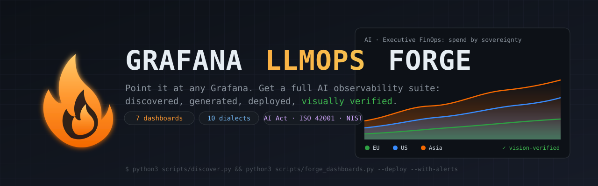
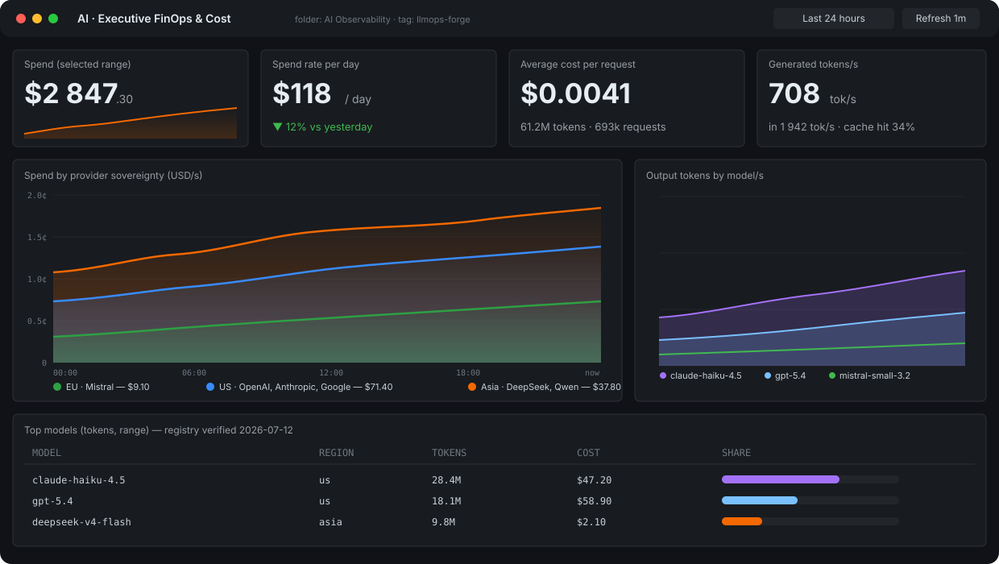
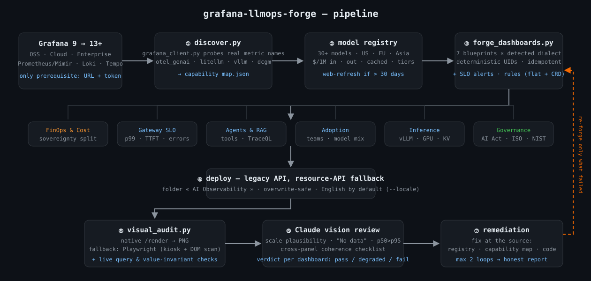

<div align="center">



# grafana-llmops-forge

**Point it at any Grafana. Get a complete AI/LLM observability suite — discovered, generated, deployed, and *visually verified*.**

[](../../actions/workflows/ci.yml)
[](#-security-model)
[](#-security-model)
[](references/grafana_api_compat.md)
[-d2a8ff)](https://agentskills.io)
[](references/eu_ai_act_observability.md)
[](LICENSE)

**English** · [Français](docs/README.fr.md)

</div>

---

Your teams ship LLM features. Your CFO asks what they cost. Your board asks about the **EU AI Act**. Your SREs get paged about latency on a system nobody instrumented. And your Grafana — the tool you already trust — shows none of it.

`grafana-llmops-forge` fixes that with **one prerequisite: a reachable Grafana** (URL + service-account token). Everything else is discovered, not assumed.

> **Not the same thing as Grafana Cloud AI Observability.** Grafana shipped its own AI/agent observability (public preview, April 2026) — it's excellent, it's **Cloud-only**, and it asks you to adopt *their* SDK. This works on **self-hosted OSS**, on whatever telemetry you already emit, and adds the two things a European CIO actually gets asked about: **cost by provider sovereignty** and **EU AI Act evidence**. See the [FAQ](#faq).

```bash
export GRAFANA_URL=https://grafana.your-company.com GRAFANA_TOKEN=glsa_...

python3 scripts/discover.py --out capability_map.json          # ① what do you actually have?
python3 scripts/forge_dashboards.py \
        --capability capability_map.json \
        --blueprints auto --deploy --with-alerts               # ② forge + deploy + SLO alerts
python3 scripts/visual_audit.py --dashboards generated_dashboards  # ③ prove it renders right
```

<div align="center">
<sub><i><b>Illustration</b> (hand-drawn SVG, not a screenshot) of the FinOps blueprint: cost composed from a 30-model price registry, split by provider sovereignty. For the real thing on real data, run <code>make demo</code> — it boots Grafana + Prometheus + a synthetic LLM workload and deploys these dashboards for real in about a minute.</i></sub></div>

## Why this is different

Most "LLM dashboards" are static JSON that assume your metric names. This is a **forge**:

1. **Discovery-first, never assume.** `discover.py` probes your datasources and captures the *actual* metric names present (OTel exporters disagree on suffixes — `_seconds`, `_token`, `_total`). Panels are only generated for queries that will return data. Missing signals become an **instrumentation gap report** with exact configs, not empty panels.
2. **Four telemetry dialects, one mental model.** OpenTelemetry GenAI (`gen_ai_*`), LiteLLM gateway (`litellm_*`, native USD spend), inference engines (`vllm:*`, `tgi_*`), GPU (`DCGM_*`). Each blueprint is translated into whatever you actually emit.
3. **Cost is computed, not hoped for.** Native gateway spend when available; otherwise PromQL composed by joining your token counters with a bundled **30-model price registry** (US/EU/Asia, input/output/cached, tiered pricing) — refreshable from official pricing pages when stale.
4. **Governance is observable.** The EU AI Act dashboard maps articles (12, 26§6, 50, 73) to live signals: logging evidence, retention posture, incident watch, an auto-built model inventory with sovereignty and GPAI flags, and the post-Digital-Omnibus timeline.
5. **Verified by eye, not just by API.** HTTP 200 proves the JSON was accepted — not that the render is right. After deploy, `visual_audit.py` captures every panel (native Grafana renderer, Playwright fallback) and an AI vision pass checks scale plausibility, "No data" panels, p50>p95 impossibilities, cross-panel coherence — then loops remediation (max 2 iterations, then an honest report).

<div align="center">
<sub><i>Diagram, not a screenshot. Every box is a script in <code>scripts/</code>.</i></sub></div>

## The six blueprints

| Dashboard | Answers | Key panels |
|---|---|---|
| 💰 **Executive FinOps** | *What does AI cost, where, is it drifting?* | spend/day, cost/request, **sovereignty split 🇪🇺🇺🇸🌏**, per-team spend, top models, unpriced-models watchlist |
| 🛡 **Gateway Operations** | *Are we meeting SLOs right now?* | availability, p50/p95/p99, **TTFT**, errors by type, provider rate-limit headroom, `$model` variable |
| 🤖 **Agents & RAG** | *What do our agents do, where do they fail?* | invoke/tool rates, per-tool errors, tokens per agent, embeddings latency, **TraceQL panel** (Tempo) |
| 📈 **Adoption** | *Who actually adopted what?* | active teams, **new adopters (7d)**, model mix over time, top token consumers — shadow AI shows up here |
| ⚡ **Inference (self-hosted)** | *Do our GPUs hold, at what cost vs API?* | vLLM TTFT/TPOT, queue, **KV-cache saturation**, preemptions, GPU util/VRAM, API-price benchmark table |
| ✅ **Quality & Evals** | *Is the output any good, and is it drifting?* | eval score p50/p10, score per model, guardrail blocks, eval volume (a system can be green on latency and wrong on content) |
| ⚖ **EU AI Act Governance** | *What do we show an auditor?* | regulatory timeline (July 2026, post-Omnibus), logging evidence (Art. 12/26§6), **auto model inventory** (region/license/GPAI), incident watch (Art. 73) |

Blueprints only materialize when the underlying signals exist — no empty panels, ever.

Plus **provisioned SLO alerts** built the way SREs actually want them: **multi-window burn-rate** on the error budget (5m/1h page, 30m/6h ticket, `--slo-target`), telemetry-signal-lost (with `noDataState: Alerting` — the alert that catches a dead pipeline must not go quiet when the pipeline dies), daily budget breach, TTFT p95, vLLM KV-cache saturation, and eval-score drop.

### Cost that scales

By default the forge composes cost from token counters × a bundled price registry. That's fine to bootstrap and slow past ~15 models. So every run also writes `prometheus_rules_llmops.yml`: prices become series (`llm:price_input_usd_per_token{model=...}`) and cost becomes one recorded metric joined by vector matching. Load it into Prometheus and your FinOps panels go from a 2N-term sum to `sum(llm:cost_usd_per_second)` — unlimited models, O(1) queries, and price updates without regenerating a single dashboard. The forge detects the recorded metric on the next discovery run and switches automatically.

## Try it in 60 seconds (no Grafana needed)

```bash
make demo    # Grafana + Prometheus + a synthetic LLM metrics emitter, then the full pipeline
```

Spins up the stack, discovers it, forges and deploys all applicable dashboards with alerts, loads the generated cost recording rules, and prints the URLs (admin/admin). `make shots` captures every panel; `make demo-down` removes everything. This is also the integration test — it runs the exact code path a production instance would.

## Quick start

<details>
<summary><b>As an Agent Skill (Claude, or any agentskills.io-compatible agent)</b></summary>

Drop the folder into your skills directory, or download the packaged `.skill` from [Releases](../../releases) — it is built by CI from these sources and published with its checksum, never committed as a binary. Then just talk:

> *"Audit my Grafana at https://grafana.internal and deploy whatever makes sense — then prove it visually."*

The skill handles discovery → registry refresh → blueprint selection → deploy → vision-verified loop, and reports gaps with exact instrumentation configs.
</details>

<details>
<summary><b>As a standalone CLI (no AI required)</b></summary>

Pure Python 3.8+ stdlib. No pip install. The three commands at the top of this README are the whole workflow. `--dry-run` writes JSON without touching your instance; `--selftest` renders all six blueprints offline from a simulated capability map.
</details>

<details>
<summary><b>No LLM telemetry yet?</b></summary>

Run discovery anyway. You'll get a prioritized gap report, and [`references/instrumentation_guide.md`](references/instrumentation_guide.md) contains copy-paste configs ordered by value/effort: **LiteLLM gateway (~30 min → native USD spend)** → OTel GenAI SDK setup → vLLM/TGI scrape → dcgm-exporter → Loki retention for AI-Act evidence.
</details>

## 🔒 Security model

Skills execute code — [a 2026 Snyk audit found 36% of published skills had at least one flaw](https://github.com/obviousworks/Claude-AI-skills-collection-2026#security). This repo is designed to be auditable in one sitting:

- **Zero dependencies.** Python stdlib only (`urllib`, `json`, `hashlib`). ~2,000 lines total. Playwright is *optional*, only for the visual-audit fallback.
- **Least privilege.** Works with an Editor service-account token. Alert provisioning degrades gracefully on 403 (exports JSON for manual import).
- **No secret leakage.** The token is never logged, never embedded in dashboards, never placed in URLs.
- **No prompt-content capture.** `gen_ai.input/output.messages` stay off by default; the docs treat enabling them as a GDPR decision, not a flag.
- **Idempotent & reversible.** Deterministic UIDs, one folder, `overwrite` semantics — delete the folder, it's gone.
- **Offline-testable.** `--selftest` + `tests/audit_harness.py` (4 simulated instance topologies plus regression tests) runs with zero network, `tests/live_query_check.py` executes every generated query against a real Prometheus, and the demo stack gives a full end-to-end deploy. That's the CI — the badge above is the real workflow status, not a decorative one.

## Repo layout

```
SKILL.md                      # agent playbook (7-phase pipeline, doctrine, pitfalls)
scripts/
  grafana_client.py           # universal client: OSS/Cloud/Enterprise, legacy + K8s-style APIs
  discover.py                 # capability map: real metric names, dialects, gaps
  forge_dashboards.py         # 6 blueprints × detected dialect, cost engine, alerts
  visual_audit.py             # render/Playwright capture + DOM pre-scan for vision review
references/
  model_registry.json         # 30+ models: $/1M in·out·cached, context, sovereignty, GPAI
  query_library.md            # PromQL/LogQL/TraceQL per dialect, anti-patterns
  dashboard_blueprints.md     # panel-by-panel specs + optional extensions
  instrumentation_guide.md    # exact configs to close each gap
  eu_ai_act_observability.md  # article → signal → panel mapping, deployer checklist
  visual_verification.md      # vision checklist, failure signatures → fixes
  grafana_api_compat.md       # 3 API generations, editions matrix, schema v2 notes
demo/                         # docker-compose stack: Grafana + Prometheus + synthetic LLM emitter
tests/live_query_check.py     # runs every generated query against a real Prometheus
tests/audit_harness.py        # offline checks across 4 instance topologies + regressions
```

## FAQ

**Why not Grafana Cloud's own AI Observability?** Use it if you're on Cloud and happy to instrument with Grafana's SDK — it does evaluations and conversation replay well. This project targets the other case: self-hosted OSS/Enterprise, telemetry you already emit (OTel, LiteLLM, vLLM — no SDK migration), plus cost attribution by provider sovereignty and an EU AI Act evidence layer, which no vendor ships. They compose fine: nothing here conflicts with the Grafana plugins.

**Does it overwrite my existing dashboards?** No — everything lives in its own folder with `llmops-forge`-tagged, deterministically-UID'd dashboards. Re-running updates in place.

**Grafana Cloud?** Yes. Cloud is auto-detected; the image renderer is built in, so visual audit works out of the box.

**My models aren't in the registry.** They appear in an "unpriced models" panel instead of being billed wrong. Add a price or alias to `model_registry.json`, re-forge. (The matcher scores by specificity — `gpt-5.4-mini` will never be billed at `gpt-5.4` rates; there's a test for that.)

**Can I publish the generated dashboards?** Yes — `--export-portable` emits JSON with `__inputs`/`${DS_PROMETHEUS}` placeholders, the format grafana.com/dashboards requires.

**Multiple Prometheus (prod + staging)?** Discovery flags it and the forge tells you which one it picked; pin it with `--datasource <uid|name>`.

**Is the AI Act dashboard legal advice?** No, and it says so on the dashboard. It's the *evidence layer* your counsel will ask you for.

## Roadmap

- [ ] Native schema-v2 output (tabs/conditional layouts) for Grafana 13+ as-code shops
- [ ] Cache-savings & budget burn-down panels (specs in `dashboard_blueprints.md`)
- [ ] Conversation-level cost attribution via exemplars (click a cost spike → the exact agent run)
- [ ] OpenAI/Gemini usage-API pollers for orgs with zero telemetry
- [ ] Terraform/Grafana-as-code export mode

## Support

Issues and discussions are the place for bugs and questions — I read everything. If your organisation needs this wired into a real platform (multi-tenant Grafana, AI Act evidence pack for an audit, FinOps governance across business units), I do that professionally: [ia-b2b.fr](https://ia-b2b.fr).

## Contributing

Model prices drift quarterly — **registry PRs are the most valuable contribution** and take 2 minutes ([guide](CONTRIBUTING.md)). Dialect additions (new gateway/engine signatures) are second. `python3 tests/audit_harness.py` must stay green.

<div align="center">
<sub>Built with the <a href="https://agentskills.io">Agent Skills</a> open standard · works in Claude Code, Claude.ai, Cowork, and as a plain CLI.<br/>
If this saved your platform team a sprint, a ⭐ helps the next DSI find it.</sub>
</div>
